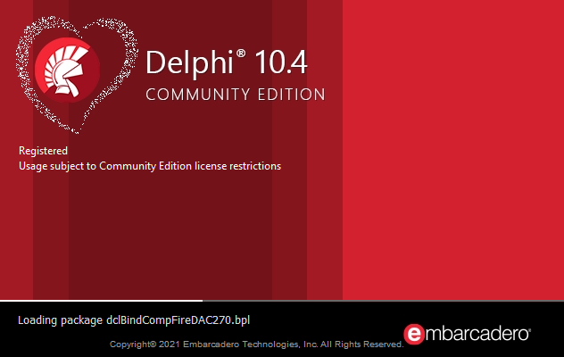

# Trabalhando com Json em Delphi 
---

---

## Propósito
Exercitar e conhecer recursos que o conhecimento e aplicabilidade em JSON com Delphi, pode nos possíbilitar como desenvolvedores.

Os exemplos foram criados para mostrar a técnica de conversabilidade, e recursos que a linguagem nos permitem utilizar.

## Exemplos

1. Ler a cotação do dólar de um dia, consumir a API do Banco Central "**CotacaoDolarDia**", para leitura do preço de venda, compra e data de hora da cotação. Neste exemplo transformamos a string Json em uma classe.   
   ~~~~
   StrJson --> TClasse
   ~~~~

   :soon: [Cotação Diária](cotacao-dolar/README.md)

2. Ler a cotação do dólar de um período, consumindo a API do Banco Central "**CotacaoDolarPeriodo**", e gerar um gráfico em ***HTML 5***, utilizando o [**Bootstrap 5.1**](https://getbootstrap.com/docs/5.1/getting-started/introduction/) e [**Chart.js**](https://www.chartjs.org/docs/latest/), como o component ***TEdgeBrowser***. 
   
   Neste exemplo transformamos uma string Json em um array de Classe.
   ~~~~
   StrJson --> TArray<TClasse>
   ~~~~

   :soon: [Cotação Período](grafico-dolar/README.md)

   ---

   Neste exemplo, as classes foram separadas para atender SRP, `Single Responsibility Principle`, um dos princípos do design pattern [[***S***]OLID](https://pt.wikipedia.org/wiki/SOLID). 

   Não irei seguir a risca o design pattern, pois ao decorrer desta série, aplicarei também os princípios de ***GoF***, [`Gang of Four`](https://pt.wikipedia.org/wiki/Padr%C3%A3o_de_projeto_de_software#Padr%C3%B5es_GoF_('Gang_of_Four')),como por exemplo, neste o Proxy

   ---