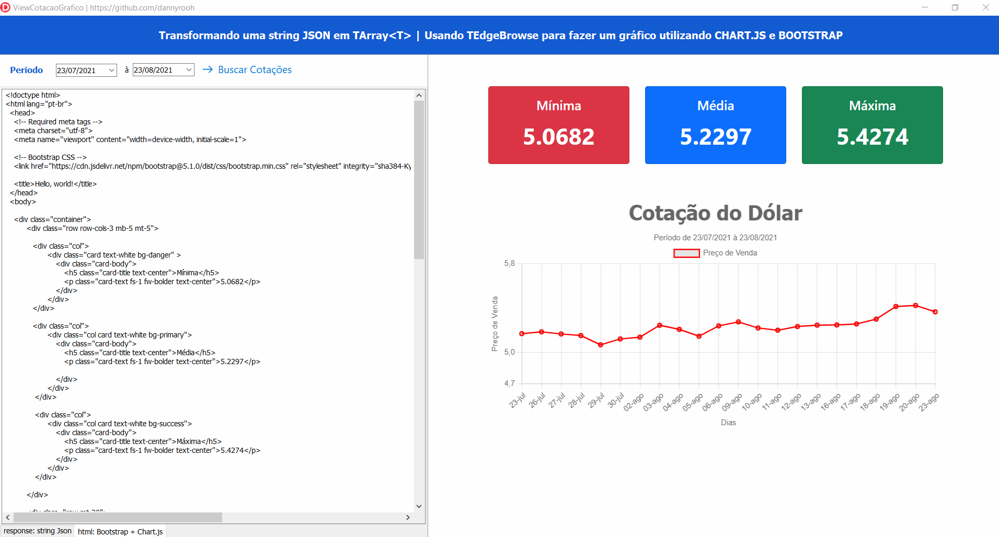

# Gráfico da cotação do Dólar
   
BOOTSTRAP + CHART.JS + (Delphi) TEdgeBrowser
---

Este exemplo faz a busca da cotação do dólar de um período através da API do Bacen`(Banco Central do Brasil)` ***"CotacaoDolarPeriodo"*** no formato em Json, retornado uma lista de cotações; essas cotações em Json são transformados em um array de classes, e na sequência geram os valores para montar o HTML5 com bootstrap e chart.js. O HTML 5 é passado diretamente para o browse imbutido num TForm Delphi.

> Para saber mais sobre o projeto de dados abertos do Banco Central do Brasil, acesse:
> <https://olinda.bcb.gov.br/olinda/servico/Expectativas/versao/v1/documentacao>
> <https://olinda.bcb.gov.br/olinda/servico/PTAX/versao/v1/documentacao#CotacaoDolarPeriodo>

### exemplo da chamada da API

> <https://olinda.bcb.gov.br/olinda/servico/PTAX/versao/v1/odata/CotacaoDolarPeriodo(dataInicial='07-01-2021',dataFinalCotacao= '07-31-2021')?@dataCotacao=%S&$top=100&$format=json&$select=cotacaoCompra,cotacaoVenda,dataHoraCotacao>;

## Versão utilizada do Delphi

Delphi Community 10.4

### Requisitos
   * Instalar o pacote Edge WebView2
   * Configuração de projeto para DLLs do carregador WebView2
 
     <https://docwiki.embarcadero.com/RADStudio/Sydney/en/Using_TEdgeBrowser_Component_and_Changes_to_the_TWebBrowser_Component>

     ***link para baixar o instalador via microsoft***
     <https://developer.microsoft.com/en-us/microsoft-edge/webview2/#download>

     ---
     :arrow_right: [Instalando WebView2 para TEdgeBrowse](../resources/tutorial/webview2.md)

     ---
     
     

   * ***Bootstrap***
    
     :hash: Usar o css e js direto do CDN ou baixar as dependências num diretorio e a apontar o caminho 
     
     ***para maiores informações do uso do Bootstrap***

     <https://getbootstrap.com/docs/5.1/getting-started/introduction/>

   * ***Chart.js***
  
     :hash: Usar o chart.js direto do CDN ou baixar as dependências num diretorio e a apontar o caminho 
     
     ***para maiores informações do uso do Chart.js*** 
     
     <https://www.chartjs.org/docs/latest/getting-started/>

## O que foi utilizado

- Regex
  
    Utilizado para pegar somente o conteúdo de value, utilizado o pattern **\[(.+)\]** com  __TRegex.Match__ da unit __System.RegularExpressions__

    **Pattern** 
    >Retorna tudo que estiver entre colchetes, inclusive os colchets
    ~~~~
    \[(.+)\]
    ~~~~
    
   ~~~delphi 
   {"@odata.context":
   "https://was-p.bcnet.bcb.gov.br/olinda/servico/PTAX/versao/v1/odata
   $metadata#_CotacaoDolarPeriodo(cotacaoCompra,cotacaoVenda,dataHoraCotacao)",
   "value":[
      {"cotacaoCompra":5.42680,"cotacaoVenda":5.42740,"dataHoraCotacao":"2021-08-20 13:10:39.797"},
      {"cotacaoCompra":5.36800,"cotacaoVenda":5.36860, "dataHoraCotacao":"2021-08-23 13:10:34.583"}
      ]
   }
   ~~~

  retorno

  ~~~~
  [
     {"cotacaoVenda":5.4274,"cotacaoCompra":5.4268,"dataHoraCotacao":"2021-08-20 13:10:39.797"}
     {"cotacaoVenda":5.3686,"cotacaoCompra":5.368,"dataHoraCotacao":"2021-08-23 13:10:34.583"}
  ]
  ~~~~

- Http
    
     Executa o get na url e retorna os dados em Stream
    > unit __IdHTTP__ , classe __TIdHTTP__

- Conversão de Stream em String 
   > TEncoding.GetBufferEncoding

- Conversão de um string Json para uma um objeto<T>  __Generics__
   > TJSONObject.ParseJSONValue(TEncoding.ASCII.GetBytes(strJson), 0)

   >  TJson.JsonToObject\<T>

- TEdgeBorwse

  localiza as marcações no Html e faz a substituiçãoo
  
  ~~~~
  mmoHTML.Lines.Text :=
    html
      .Replace('{{datalabel}}',datalabel)
      .Replace('{{datasetdata}}',datasetdata)

      .Replace('{{minimo}}',FloatToStr( minima ,fs ))
      .Replace('{{media}}',FormatFloat('0.0000', media ,fs ))
      .Replace('{{maxima}}',FloatToStr( maxima ,fs ))

      //valores máximos e mínimos do eixo y
      .Replace('{{preco_minimo}}',FloatToStr( minima-(minima*0.07) ,fs ))
      .Replace('{{preco_maximo}}',FloatToStr( maxima+(maxima*0.07) ,fs ))

      .Replace('{{Periodo}}',Format('Período de %s à %s',
        [
          DateToStr(edtInicial.Date),
          DateToStr(edtFinal.Date)
        ]))
      ;
   EdgeBrowser1.NavigateToString( mmoHTML.Lines.Text );
   ~~~~

## Uses

* IdHTTP
* IdSSLOpenSSL
  
* System.JSON
* Rest.Json

* System.Classes,
* System.SysUtils,
* System.Math,
* System.RegularExpressions

