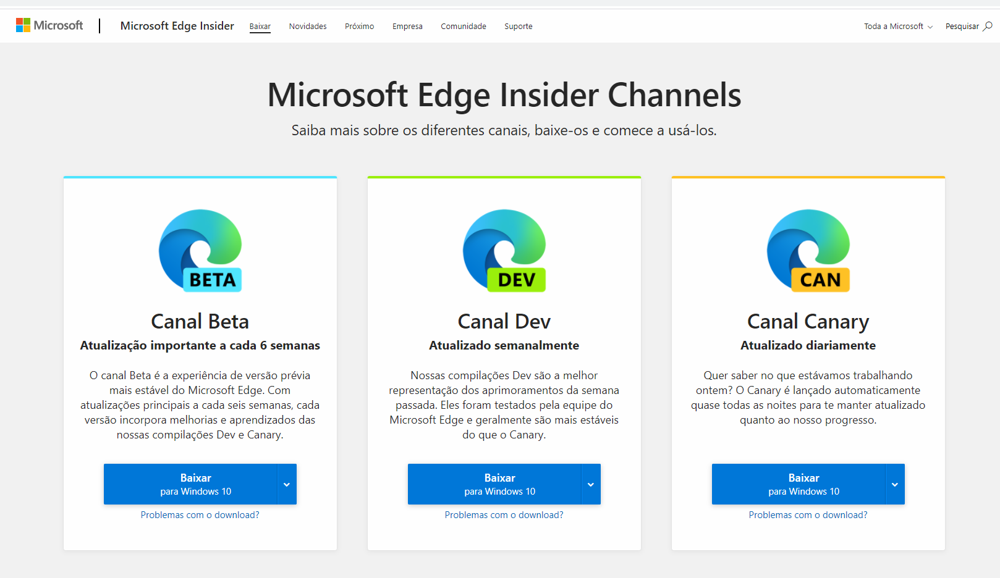
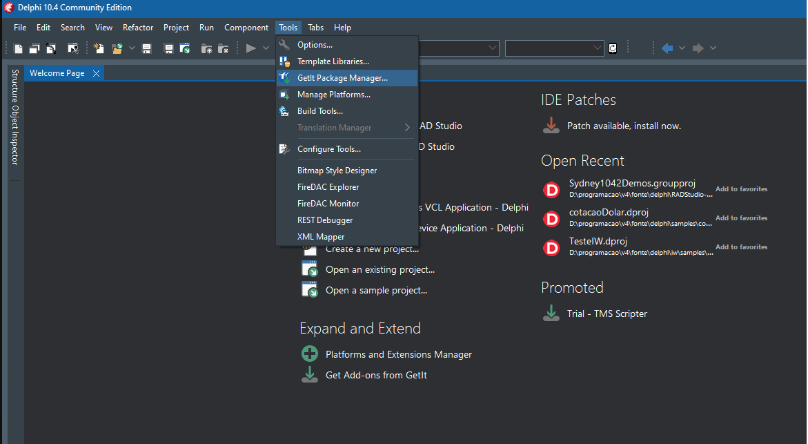
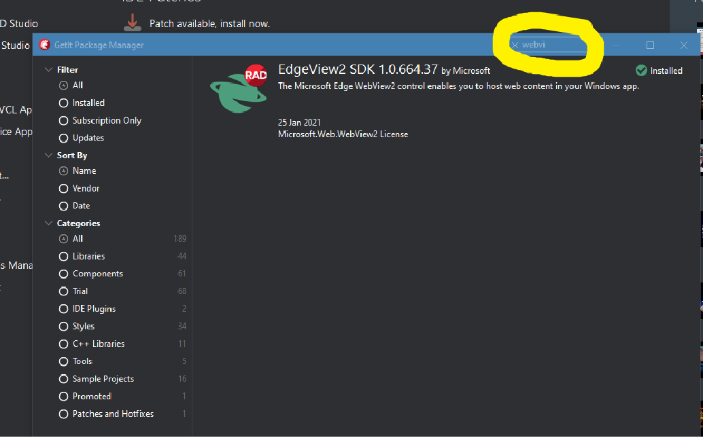
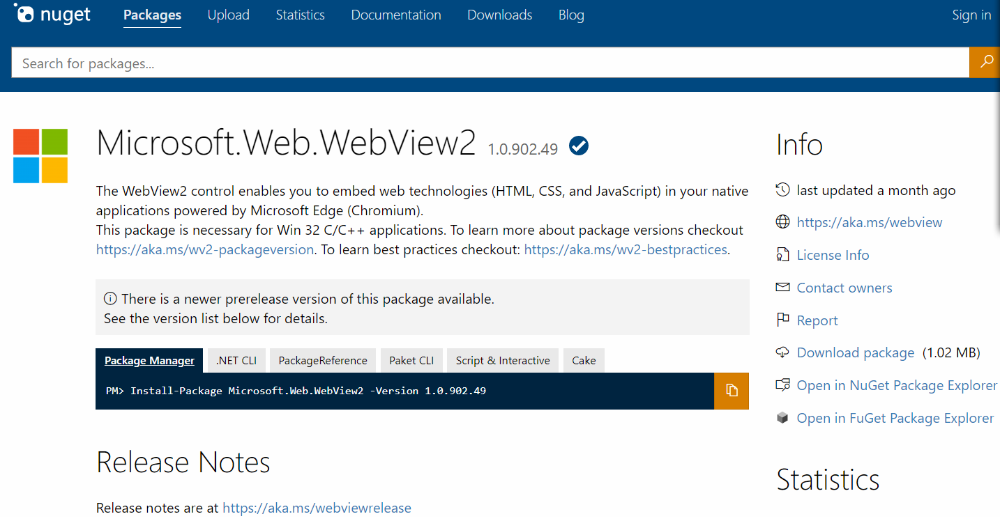
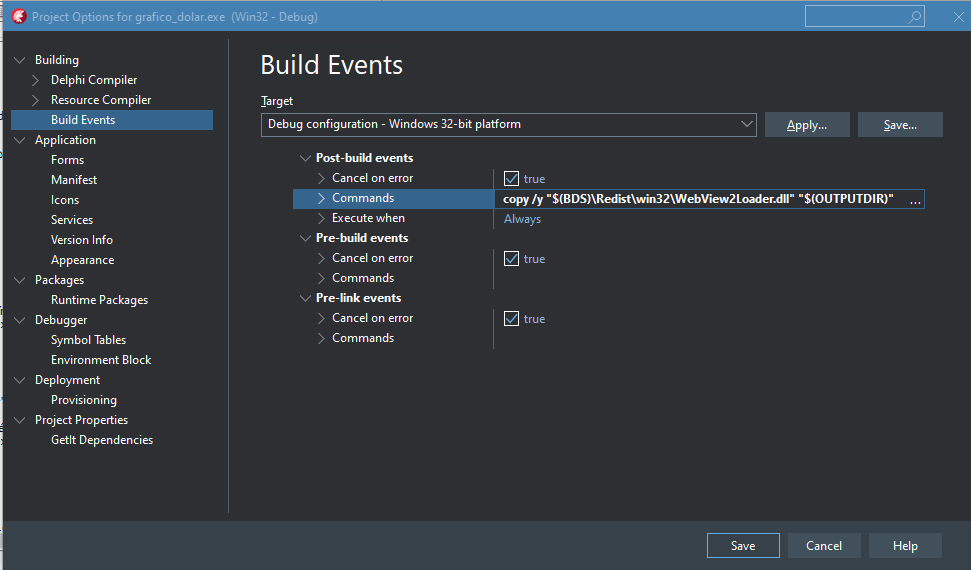

# Instalando WebView2 para TEdgeBrowser
---

A partir da versão Sydney do Rad Studio, `versão 10.4`, ela oferece suporte para se trabalhar com conteúdo web por meio do navegador Edge WebView2 (TEdgeBrowser) baseado em crhomium em aplicativos VCL.

O TEdgeBrowser bubstitui TWebBrowse, que usa o controle do Internet Explorer webBeowser.

## TWebBrowse x TEdgeBrowser

O **TWebBrowser**  usa o Internet Explorer WebBrowser fornecido pelo sistema operacional, se o Windows tiver o controle do Internet Explorer não é necessário instalar nada.

O **TEdgeBrowser** não é um componente do sistema operacional até o momento, então é necessário instalar o SDK WebView2. ***Será necessário instalar tanto no máquina de desenvolvimento, quanto na máquina do usuário final.***

### 1. Instalação via arquivo Microsoft Edge Update Setup
   
   Acesse o link e baixe a atualização <https://www.microsoftedgeinsider.com/pt-br/download>

  

  Acesso o site, escolha uma das opções, faça o download e instale o sdk, fazendo um nova instalação ou update

### 2. Instalação pelo Delphi

   Tools / Getit Package Manager
  
  

   Na janela que abrir, pesquise por WebView na caixa de pesquisa, e instale o EdgeView2 SDK, ou superior

      

### 3. instalação Manual via NuGet

  Acesse um dos links, baixe e instale
  1. https://www.nuget.org/packages/Microsoft.Web.WebView2 
  2. https://www.nuget.org/packages/Microsoft.Web.WebView2/0.9.430 
  
      

   
# Configurando o Delhi para compilar e colocar o dll para enviar com sua aplicação

Com a sua aplicação aberta no delphi
 * vá para o menu Project/Option, 
 * ou pressione Shift + Ctrl + F11 
 * ou clique com o botão direito do mouse sobre o .dpk da sua aplicação e com o menu popup aberto, clique em options.

Na tela do Project Options, vá em Building/Build Events e coloque o comando para copiar ***WebView2Loader.dll*** para o destino de seu executável. 

***`Observe em qual plataforma está seu executável`***

  ~~~
  copy /y "$(BDS)\Redist\win32\WebView2Loader.dll" "$(OUTPUTDIR)"

  copy /y "$(BDS)\Redist\win64\WebView2Loader.dll" "$(OUTPUTDIR)"
  ~~~

    
